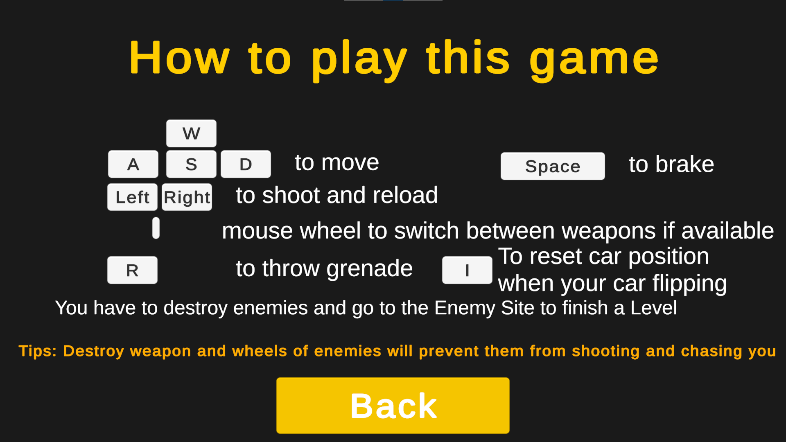

# URPPrototyping
A simple 3D mini cannon shooter game
- This project using Unity Engine with Universal Render Pipeline
- It is an update from previous version using legacy: [***UnityPrototying***](https://github.com/PhamTDuc/UnityPrototying/tree/feature)
## To test this game, please download one of three file *.zip from link [***Builds***](https://github.com/PhamTDuc/URPPrototyping/tree/trunk/BuildsForTest)
## How to play

## Gameplay

## How to go to next level

